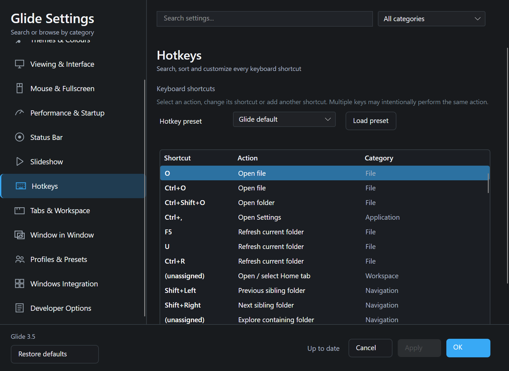
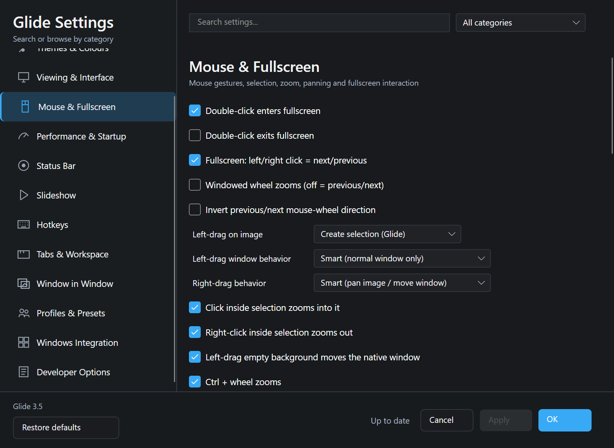
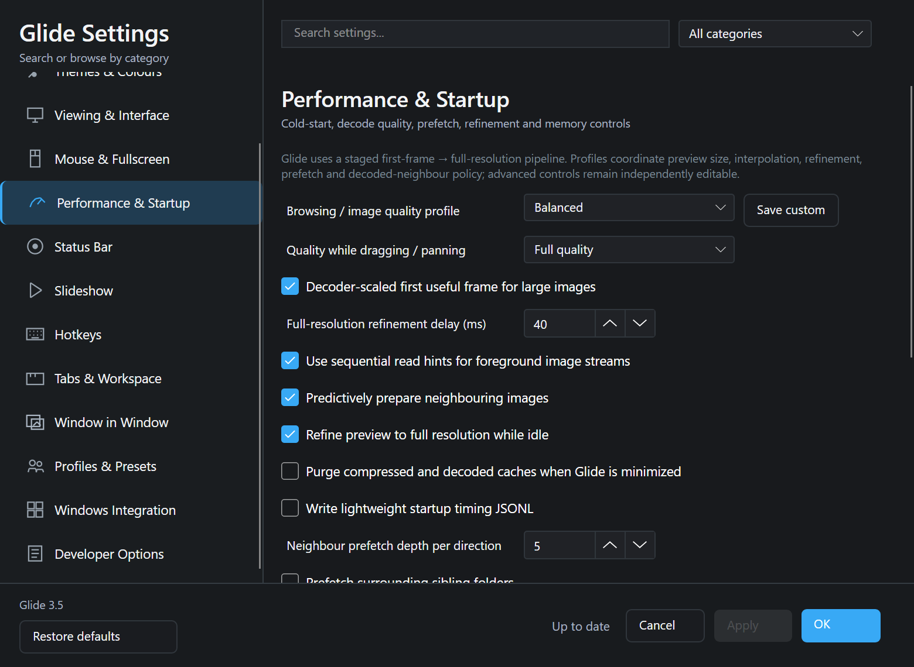
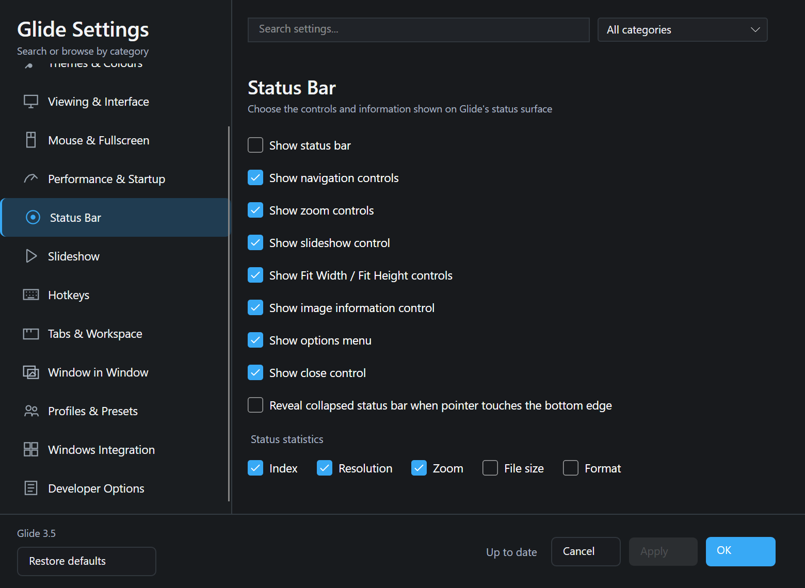
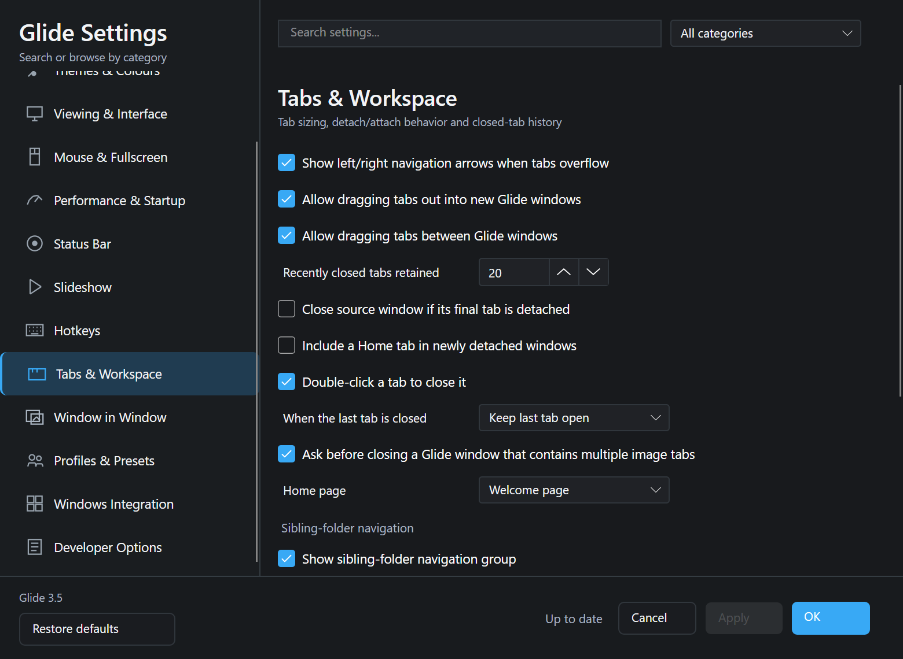
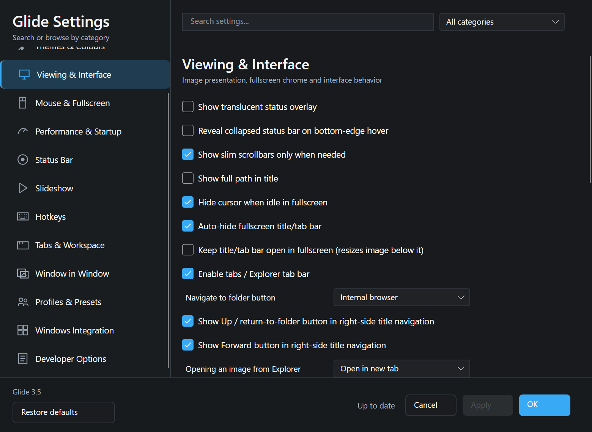
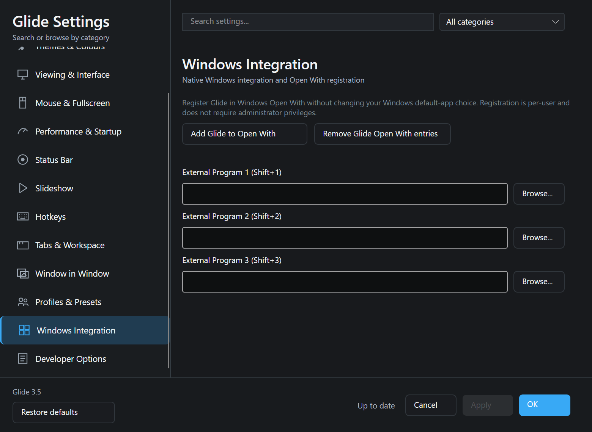

# Glide 3.5

## Fast. Lightweight. Multi-tabbed. Multi-window. Highly customizable.

**Glide is a Windows image viewer built around instant-feeling image opening, a compact ~14 MB installer, multi-tab and multi-window workflows, overlays, deep mouse/keyboard customization, and recognition/routing for 196 image/document filename extensions.**

Glide is designed for people who want the speed and simplicity of a classic lightweight viewer without giving up modern tabbed workflows, configurable fullscreen behaviour, image overlays, extensive hotkeys, profiles, prefetch controls, and a settings system that exposes the viewer's behaviour instead of hard-coding it.

> **Format breadth:** Glide recognizes and routes **196 suffixes**. The protected built-in fast path covers JPEG/JPG, PNG, BMP, GIF, TIFF, WebP and ICO-family essentials; additional formats may be satisfied by Windows WIC, verified optional codec providers, or Windows Shell preview/rasterization depending on the format and installed platform capabilities.

## Highlights

- **Speed-first startup and navigation** — single real-window startup, staged first-frame → full-resolution refinement, decoder-scaled previews, neighbour prefetching, cache controls and rapid-navigation previews.
- **Lightweight distribution** — approximately **14 MB installer** while retaining a broad feature set.
- **Tabbed image workspace** — multiple images in one window, detachable tabs, tab transfer between Glide windows, recently closed tabs and configurable tab behaviour.
- **Multiple independent windows** — open new windows or duplicate sessions, with window size/placement-aware behaviour.
- **196 recognized/routed extensions** — broad raster, RAW, HDR, medical/scientific, vector/document and texture/container suffix coverage.
- **Fullscreen built for viewing** — configurable caption-button actions, mouse navigation, cursor hiding, title/tab auto-hide and exact pre-fullscreen placement restoration.
- **Overlay / Window-in-Window mode** — transparent image overlays, opacity controls, zoom/pan, edge chrome, always-on-top and optional windowed-style interactions.
- **Deep input customization** — configurable left/right drag policies, gesture matrix, mouse-wheel behaviour and rebindable hotkeys.
- **Viewer profiles and presets** — Glide, Windows Photos, IrfanView, nomacs, FastStone and XnView MP interaction/hotkey presets.
- **Built-in diagnostics** — permanent diagnostics and exportable diagnostic ZIPs for performance, UI and behaviour troubleshooting.

## Settings & customization

Glide's Settings window is intentionally extensive. The controls shown in the screenshots are described below so the repository doubles as a reference for what can be customized.

### General

Application, history, folder traversal and startup behaviour:

- Keep recent file/folder history and choose the history size.
- Remember window position, size and maximized state.
- Reuse one Glide instance for Explorer image launches.
- Automatically continue into sibling folders.
- Continue into nearby parent/grandparent folder branches.
- Confirm before leaving the current folder branch.
- Set a default **Open File** directory, or remember the last Open/Open Folder location.
- Show Quick Tips cards on Home.
- Show or hide recently opened files/folders on Home.
- Warn before discarding unapplied Settings changes.
- Choose what Glide opens to: **Welcome tab, last session, Explorer tab or custom path**.
- Configure a custom startup file/folder.
- Choose what a **new tab** opens to: Explorer, Welcome or custom content.
- Make new Explorer tabs reuse their last navigated directory.
- Set default Explorer-tab and custom new-tab paths.

### Themes & Colours

Visual appearance and sizing:

- Theme: **Dark, Neutral or Light**.
- Explorer theme can follow Glide or use its own Dark/Neutral/Light theme.
- Accent colour presets plus a custom colour picker.
- Glow colour can follow the accent or use its own preset/custom colour.
- Main image background can follow the theme or use black, gray, white or a custom colour.
- Adjustable glow intensity.
- Status bar size from very small through extra large.
- Global status-bar scale.
- Additional maximized/fullscreen size boost.
- Minimum and maximum tab widths.
- Text-overlay font size, bold state, opacity, position, colour and shadow.
- Default Window-in-Window overlay opacity.
- Optional accent-colour highlight for the selected overlay.

### Viewing & Interface

Core viewer presentation and navigation:

- Show/hide the translucent status overlay.
- Optional bottom-edge reveal for a collapsed status bar.
- Slim scrollbars only when needed.
- Show full file path in the title.
- Hide the cursor when idle in fullscreen.
- Auto-hide the fullscreen title/tab bar.
- Optionally keep the title/tab bar open in fullscreen and resize the image below it.
- Enable/disable tabs and the Explorer tab bar.
- Choose the folder-navigation action: **internal browser** or **Windows Explorer**.
- Show/hide Up/return-to-folder and Forward buttons in title navigation.
- Choose what opening an image from Explorer does: **new tab, new window or overwrite existing tab**.
- Choose what happens when Explorer opens an image that is already open: **new instance (default), refresh existing image or open new tab**.
- Customize title-bar buttons.
- Independently assign windowed and fullscreen **Minimize, Maximize/Restore and Close** button actions.
- Keep the status bar visible in fullscreen.
- Always keep Glide on top.
- Choose fullscreen exit behaviour: **restore exact size/location, maximize or minimize**.
- Default view for new images: **Fit image, Fit width, Fit height or 100%**.
- Zoom around the mouse pointer.
- Preserve manual zoom while navigating.
- Configure Escape behaviour for slideshow, fullscreen and windowed close.
- Clear the remembered Escape-close choice.

### Mouse & Fullscreen

Pointer, drag and fullscreen interaction:

- Double-click to enter fullscreen.
- Double-click to exit fullscreen.
- Fullscreen left/right click for next/previous image.
- Windowed mouse wheel can zoom or navigate.
- Invert previous/next wheel direction.
- **Left-drag on image:** create selection, pan image or move window.
- **Left-drag window behaviour:** Smart (normal window only), never move window, or allow move when maximized.
- **Right-drag behaviour:** Smart (pan image / move window), pan image only, move window, or do nothing.
- Click inside a selection to zoom into it.
- Right-click inside a selection to zoom out.
- Optionally let left-drag on empty background move the native window.
- Ctrl + wheel zoom.
- Middle-drag pans a zoomed image.
- Advanced gesture matrix for assigning semantic Glide actions to physical pointer contexts.
- Reset the gesture matrix independently.

### Performance & Startup

Image quality, startup and navigation tuning:

- Browsing/image quality profiles: **Maximum speed, Balanced, Maximum quality or User custom**.
- Save a custom profile.
- Quality while dragging/panning: Fast, Balanced or Full quality.
- Decoder-scaled first useful frame for large images.
- Adjustable full-resolution refinement delay.
- Sequential read hints for foreground streams.
- Predictive neighbour preparation.
- Idle full-resolution refinement.
- Optional cache purge when Glide is minimized.
- Lightweight startup timing JSONL.
- Neighbour prefetch depth per direction.
- Prefetch surrounding sibling folders.
- Number of pictures to prefetch per surrounding folder.
- Compressed-cache item limit and MB budget.
- Decoded-frame memory budget.
- Preview longest-side size.
- Rapid-navigation preview size.
- Reduced-frame rapid navigation activates only during sustained keyboard/wheel bursts; isolated navigation remains normal quality.
- Keep the first progressive-JPEG frame in colour, with final refinement restoring full fidelity.

### Status Bar

Choose exactly what appears in the status bar:

- Show/hide the entire status bar.
- Navigation controls.
- Zoom controls.
- Slideshow control.
- Fit Width / Fit Height controls.
- Image information control.
- Options menu.
- Close control.
- Optional bottom-edge reveal while collapsed.
- Select status statistics individually: **index, resolution, zoom, file size and format**.
- At narrow widths Glide can reflow the controls into multiple horizontal rows rather than forcing one long row.

### Slideshow

- Slideshow interval in milliseconds.
- Loop slideshow.
- Continue across picture folders.
- Shuffle images.
- Forward/backward direction when not shuffled.
- Enter fullscreen when slideshow starts.
- Pause slideshow while Glide is not the active window.

### Hotkeys

- Full keyboard-shortcut editor with action and category views.
- Multiple shortcuts may intentionally map to the same action.
- Presets for **Glide default, Windows Photos, IrfanView, nomacs, FastStone and XnView MP**.
- Change, add or remove shortcuts.
- Reset hotkeys.

### Tabs & Workspace

- Show left/right arrows when tabs overflow.
- Drag tabs out into new Glide windows.
- Drag tabs between Glide windows.
- Choose how many recently closed tabs to retain.
- Close the source window if its final tab is detached.
- Include a Home tab in newly detached windows.
- Double-click a tab to close it.
- Last-tab behaviour: **keep last tab open or close the program**.
- Ask before closing a window containing multiple image tabs.
- Choose the Home page: **Welcome, Browser or Recent pictures**.
- Optional sibling-folder navigation group.
- Individual Previous Folder, Next Folder and Explore Parent Folders controls.
- Skip sibling folders containing no supported images.
- Include hidden sibling folders.
- Wrap sibling-folder navigation at directory ends.
- Choose whether a sibling folder opens its first or last image.

### Window in Window / Overlay

Text overlays and whole-app/image overlays:

- Show/hide the text overlay template.
- Fully configurable text-overlay template.
- Template tokens include index/total, file name, stem, extension/format, folder/path, dimensions, megapixels, file size and zoom.
- Start Glide directly in whole-application **Overlay / Window-in-Window mode**.
- Use normal windowed image interactions while in Overlay mode when preferred.
- Show Window-in-Window controls in the status bar.
- Remember the last overlay-image folder.
- Restore overlays automatically on the next launch, including position, size, zoom, pan and opacity.
- Selected overlay receives keyboard +/- zoom.
- Mouse wheel zooms the hovered or selected overlay.
- Adjustable overlay zoom step.
- Remember overlay zoom in saved layouts.
- Right-click-and-hold pans cropped/zoomed overlay content.
- Scale overlay size proportionally when the main Glide window resizes.
- Set a default overlay directory.
- Whole-app Overlay mode supports transparent composition so transparent PNG regions and unused transparent areas can reveal the desktop where the Windows compositor supports it.

### Profiles & Presets

- Interaction presets for **Glide, Windows Photos, IrfanView, nomacs, FastStone and XnView MP**.
- Apply presets as staged Settings changes.
- Add named user profiles.
- Choose a default profile directory.
- Import/export portable settings.

### Windows Integration

- Add Glide to **Windows Open With** without changing the system default application.
- Remove Glide's Open With entries.
- Per-user registration; administrator privileges are not required.
- Configure up to three external programs, available through Shift+1 / Shift+2 / Shift+3.

### Developer Options

Advanced and diagnostic controls:

- Reverse selection-to-zoom-out scaling so a smaller selection produces a larger zoom-out.
- Automatically shrink/reflow the status bar for narrow windows.
- Optionally keep Window-in-Window overlay coordinates absolute while the main window is resized, maximized or fullscreen.
- Run built-in diagnostics.
- Export a Diagnostic ZIP containing UI screenshots, geometry, settings state/effect coverage and structural tests.

## Settings screenshots

The screenshots below are the current Glide 3.5 Settings UI. They are kept in the repository so behaviour and options can be reviewed without installing the application.

<strong>Open complete settings screenshot gallery (40 screenshots)</strong>

#### Settings Developer Immediate

#### Settings Developer Settled

#### Settings Export Time

#### Settings General Immediate

#### Settings General Scroll2 Settled

#### Settings General Settled

#### Settings Hotkeys Immediate

#### Settings Hotkeys Scroll2 Settled

#### Settings Hotkeys Settled

#### Settings Mouse Immediate

#### Settings Mouse Scroll2 Settled

#### Settings Mouse Scroll3 Settled

#### Settings Mouse Scroll4 Settled

#### Settings Mouse Settled

#### Settings Overlays Immediate

#### Settings Overlays Scroll2 Settled

#### Settings Overlays Settled

#### Settings Performance Immediate

#### Settings Performance Scroll2 Settled

#### Settings Performance Settled

#### Settings Profiles Immediate

#### Settings Profiles Settled

#### Settings Resize Compact

#### Settings Resize Standard

#### Settings Resize Tall

#### Settings Resize Wide

#### Settings Search Hotkey Settled

#### Settings Slideshow Immediate

#### Settings Slideshow Settled

#### Settings Status Immediate

#### Settings Status Settled

#### Settings Tabs Immediate

#### Settings Tabs Scroll2 Settled

#### Settings Tabs Settled

#### Settings Viewing Immediate

#### Settings Viewing Scroll2 Settled

#### Settings Viewing Scroll3 Settled

#### Settings Viewing Settled

#### Settings Windows Immediate

#### Settings Windows Settled

## Recognized / routed formats

Glide's current routing registry contains **196 filename suffixes**:

<strong>Show all 196 recognized/routed suffixes</strong>

`.jpg`, `.jpeg`, `.jpe`, `.jfif`, `.jif`, `.jfi`, `.pjpeg`, `.pjpg`, `.png`, `.apng`, `.mng`, `.jng`, `.bmp`, `.dib`, `.rle`, `.wbmp`, `.tif`, `.tiff`, `.btf`, `.gif`, `.ico`, `.cur`, `.ani`, `.icns`, `.webp`, `.heic`, `.heif`, `.heics`, `.heifs`, `.hif`, `.avif`, `.avifs`, `.svg`, `.svgz`, `.jxr`, `.wdp`, `.hdp`, `.jp2`, `.j2k`, `.j2c`, `.jpc`, `.jpx`, `.jpf`, `.jpm`, `.mj2`, `.jxl`, `.psd`, `.psb`, `.pdd`, `.xcf`, `.ora`, `.kra`, `.afphoto`, `.afdesign`, `.afpub`, `.clip`, `.csp`, `.pdn`, `.psp`, `.pspimage`, `.pxr`, `.tga`, `.targa`, `.icb`, `.vda`, `.vst`, `.dpx`, `.cin`, `.sgi`, `.rgb`, `.rgba`, `.bw`, `.ras`, `.sun`, `.iff`, `.lbm`, `.ilbm`, `.img`, `.pic`, `.pict`, `.pct`, `.pict2`, `.eps`, `.epsf`, `.ai`, `.pdf`, `.pnm`, `.ppm`, `.pgm`, `.pbm`, `.pam`, `.pfm`, `.pcx`, `.qoi`, `.hdr`, `.rgbe`, `.xyze`, `.exr`, `.dds`, `.ff`, `.fits`, `.fit`, `.fts`, `.fts.gz`, `.hdr.gz`, `.xbm`, `.xpm`, `.xwd`, `.cut`, `.mac`, `.mpo`, `.jps`, `.pns`, `.dng`, `.cr2`, `.cr3`, `.crw`, `.nef`, `.nrw`, `.arw`, `.srf`, `.sr2`, `.raf`, `.orf`, `.ori`, `.rw2`, `.rwl`, `.pef`, `.ptx`, `.3fr`, `.fff`, `.iiq`, `.cap`, `.eip`, `.mef`, `.mos`, `.mrw`, `.x3f`, `.erf`, `.kdc`, `.dcr`, `.k25`, `.bay`, `.srw`, `.rwz`, `.gpr`, `.mdc`, `.raw`, `.r3d`, `.ari`, `.cinema`, `.dcs`, `.drf`, `.dsc`, `.r2d`, `.rw1`, `.dcm`, `.dicom`, `.ima`, `.nii`, `.nii.gz`, `.mha`, `.mhd`, `.nrrd`, `.ndpi`, `.svs`, `.vms`, `.vmu`, `.scn`, `.mrxs`, `.bif`, `.czi`, `.lif`, `.lsm`, `.ome.tif`, `.ome.tiff`, `.vsi`, `.ktx`, `.ktx2`, `.pvr`, `.astc`, `.basis`, `.tex`, `.vtf`, `.wal`, `.spr`, `.cdr`, `.cmx`, `.cpt`, `.emf`, `.wmf`, `.emz`, `.wmz`, `.dwg`, `.dxf`, `.skp`

Recognition/routing is intentionally broader than the dependency-free built-in decoder. A routed file may be decoded through Glide's core fast path, Windows WIC, a verified optional provider, or a Windows Shell preview/rasterization path depending on format and system capabilities.

### Protected core fast-path suffixes

`.jpg`, `.jpeg`, `.jpe`, `.png`, `.bmp`, `.gif`, `.tif`, `.tiff`, `.webp`, `.ico`

## Build

On Windows, the project includes the build and installer tooling in the repository root. `build-installer.cmd` is the intended one-click installer build path.

## Project philosophy

Glide prioritizes:

1. **Perceived and measured image-open speed.**
2. **A stable single real window** with no splash-to-main-window visual handoff.
3. **Fast navigation** through large folders.
4. **Broad format routing without making optional codecs part of cold startup.**
5. **Deep customizability without forcing complexity on the default experience.**
6. **AI-friendly source structure, diagnostics and handoff documentation** so the project can be maintained efficiently.

For architecture, build internals, implementation history and agent handoff guidance, see `GLIDE_MANIFESTO_AND_HANDOFF.md`.
