# Glide 3.5

## Fast. Lightweight. Multi-tabbed. Multi-window. Highly customizable.

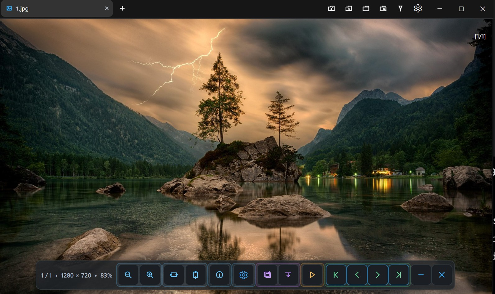

**Glide is a high-performance Windows image viewer built around instant-feeling image opening, a compact ~14 MB installer, multi-tab and multi-window workflows, transparent overlays, deep mouse/keyboard customization, and recognition/routing for 196 image and document filename extensions.**

Glide is designed for users who desire the instantaneous startup and minimal resource footprint of classic lightweight viewers without sacrificing modern multi-tabbed navigation, configurable fullscreen behaviour, non-destructive overlays, extensive hotkey mapping, viewer emulation profiles, prefetch controls, and an exhaustively configurable settings engine.

> **Format Breadth:** Glide recognizes and routes **196 suffixes**. The protected built-in fast path covers JPEG/JPG, PNG, BMP, GIF, TIFF, WebP, and ICO essentials. Additional formats are handled seamlessly via Windows WIC, verified optional codec providers, or Windows Shell preview/rasterization pipelines depending on installed platform capabilities.

---

## Visual Overview & Adaptive Layout

Glide's interface is engineered with a responsive design system that reflows seamlessly across any window size, aspect ratio, or DPI scale.

| Standard View | Wide Layout | Tall Layout | Compact Mode |
| :---: | :---: | :---: | :---: |
|  | 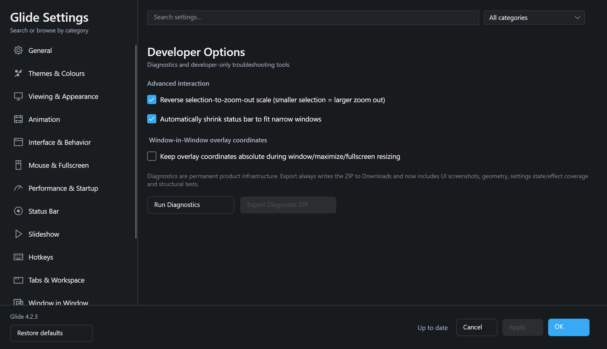 | 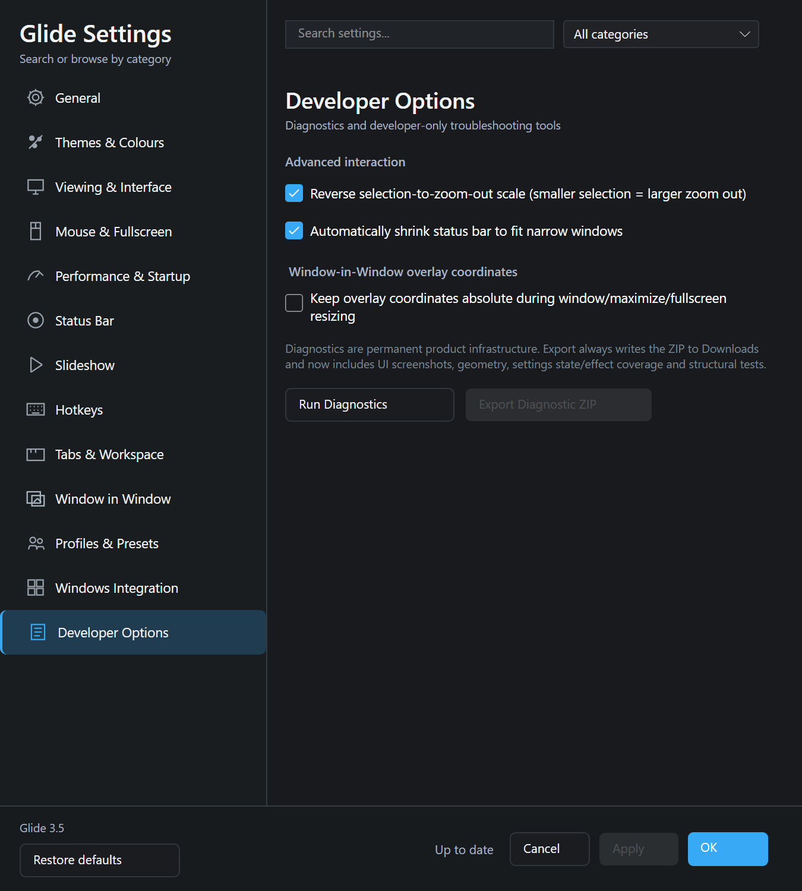 | 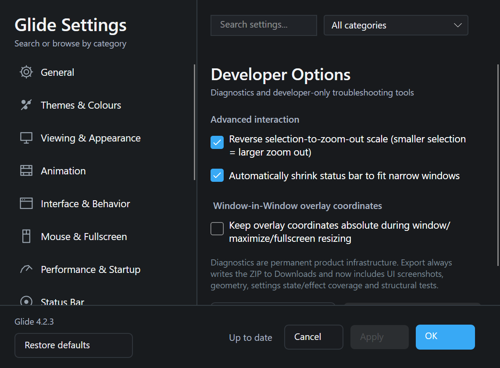 |

---

## Core Feature Reference & Settings Gallery

The Glide Settings engine exposes nearly every aspect of the viewer's execution, rendering, input handling, and presentation. The complete feature set is detailed below alongside screenshots captured directly from Glide 3.5.

---

### 1. General & Startup Navigation

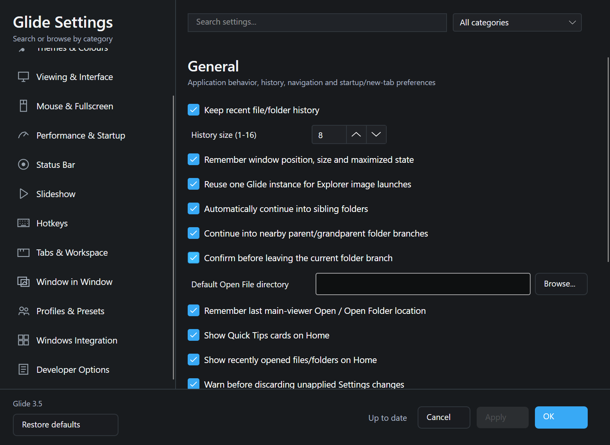
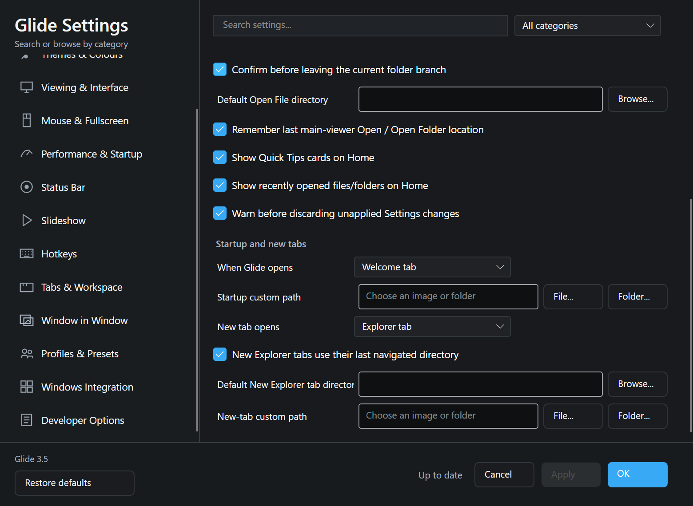

Glide provides flexible session management, folder traversal policies, and startup behaviors:

* **History & Session Retention:** Maintain recent file and folder history with a configurable capacity (e.g., 50 items). Option to display recent files/folders directly on the Home dashboard.
* **Window State Memory:** Automatically remembers window size, position, and maximized state across sessions.
* **Instance Reuse:** Single-instance mode ensures file launches from Windows Explorer open into the active Glide instance instead of spawning unnecessary background processes.
* **Hierarchical Folder Traversal:**
  * Automatically advance into adjacent sibling folders when reaching the end of the current directory.
  * Extend continuous navigation into parent/grandparent directory branches.
  * Configurable confirmation prompts before crossing directory boundaries.
* **Startup & Landing Modes:** Choose what Glide opens on startup:
  * *Welcome tab*
  * *Resume last session*
  * *Built-in Explorer tab*
  * *Custom file or directory path*
* **New Tab Landing Target:** Independently configure whether new tabs open the Explorer, Welcome page, or a custom target folder.
* **Quick Tips & Safety Guards:** Optional Quick Tips on Home and alert prompts before discarding uncommitted settings changes.

---

### 2. Tabs & Multi-Window Workspace

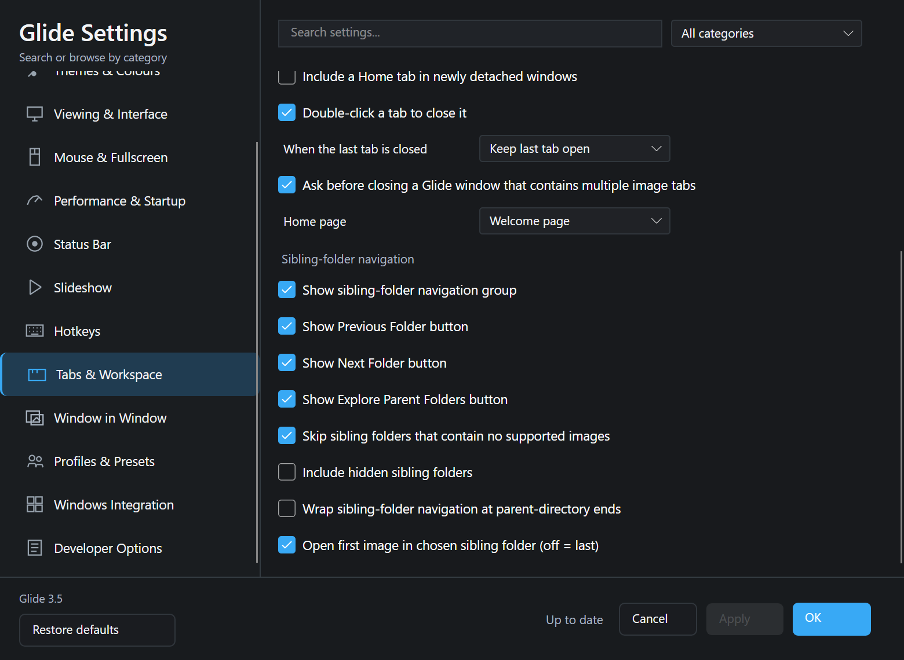

Glide brings modern browser-grade tab management to image viewing:

* **Detachable & Re-attachable Tabs:** Tear off any image tab into its own independent Glide window, or drag tabs between existing Glide windows seamlessly.
* **Closed Tab History Stack:** Retains a buffer of recently closed tabs (e.g., 10 tabs) for instant reopening.
* **Window Teardown Behavior:** Option to automatically close a source window when its final remaining tab is detached into another window.
* **Last-Tab Closing Policy:** Choose whether closing the last tab maintains an empty workspace/Home tab or terminates the application.
* **Close Protection:** Option to display a confirmation guard before closing a window containing multiple open image tabs.
* **Tab Strip Ergonomics:** Double-click any tab header to close it; visual scroll overflow arrows appear automatically when many tabs are open.
* **Sibling Folder Integration:**
  * Dedicated Previous Folder, Next Folder, and Explore Parent Folder commands.
  * Automatically skip sibling folders that contain no supported image formats.
  * Option to include or ignore hidden directories.
  * Directional preference: choose whether entering a new sibling folder opens the first or the last image.

---

### 3. Viewing & Interface Presentation

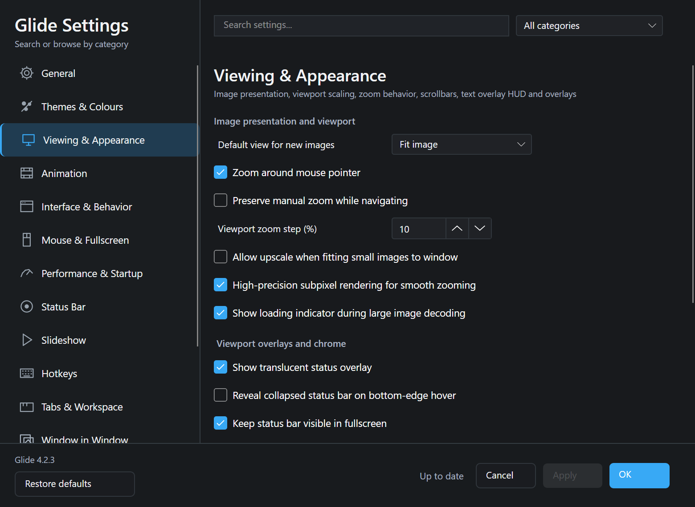
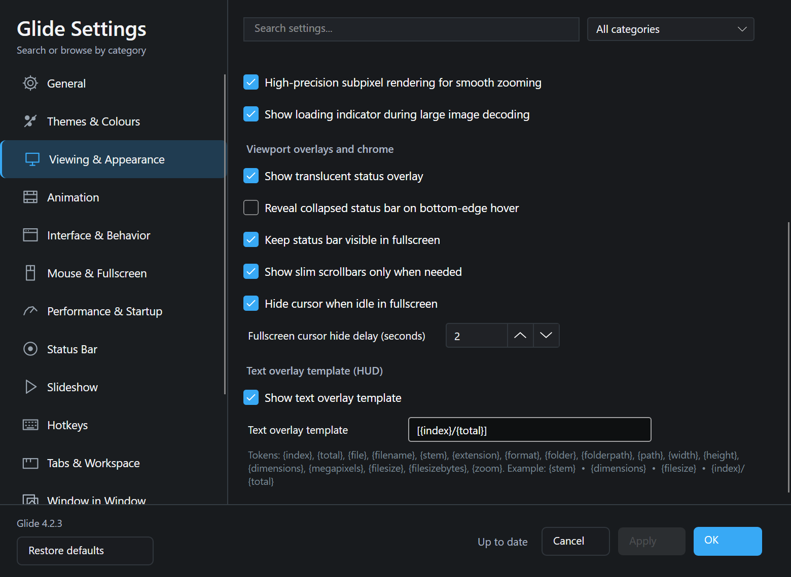
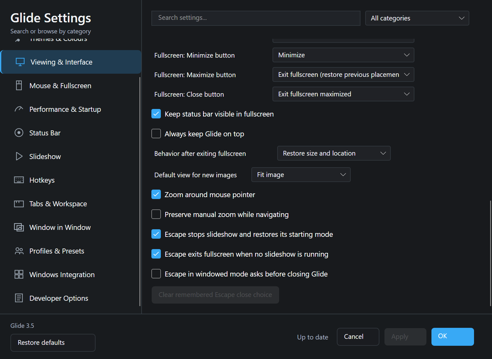

Fine-tune every visual component of the viewing canvas and window chrome:

* **Translucent Status Overlay:** Overlay floating image metadata and controls with automatic bottom-edge hover reveal when collapsed.
* **Dynamic Title Bar:** Display full image paths in the window title bar alongside customizable navigation buttons (Back, Up-to-Folder, Forward).
* **Explorer Open Actions:** Configure whether double-clicking an image in Windows Explorer creates a new tab, opens a new window, or overwrites the current tab.
* **Duplicate File Handling:** Choose behavior when launching an already-opened file (spawn new instance, refresh existing view, or switch to tab).
* **Fullscreen Experience:**
  * Auto-hide title bar and tab strip in fullscreen with smooth mouse reveal.
  * Option to pin title/tab bars in fullscreen with automatic image letterboxing.
  * Auto-hide the mouse cursor during fullscreen inactivity.
  * Exact restoration of pre-fullscreen window geometry upon exit.
* **Initial Zoom Framing:** Default view for newly opened images: *Fit to Window*, *Fit Width*, *Fit Height*, or *1:1 (100% Native Resolution)*.
* **Navigation Zoom Lock:** Option to lock and preserve manual zoom/pan levels when flipping through consecutive images in a directory.
* **Escape Key Behavior:** Map Escape independently to exit slideshow, exit fullscreen, close the current tab, or minimize the window.

---

### 4. Mouse Interactions & Gesture Matrix

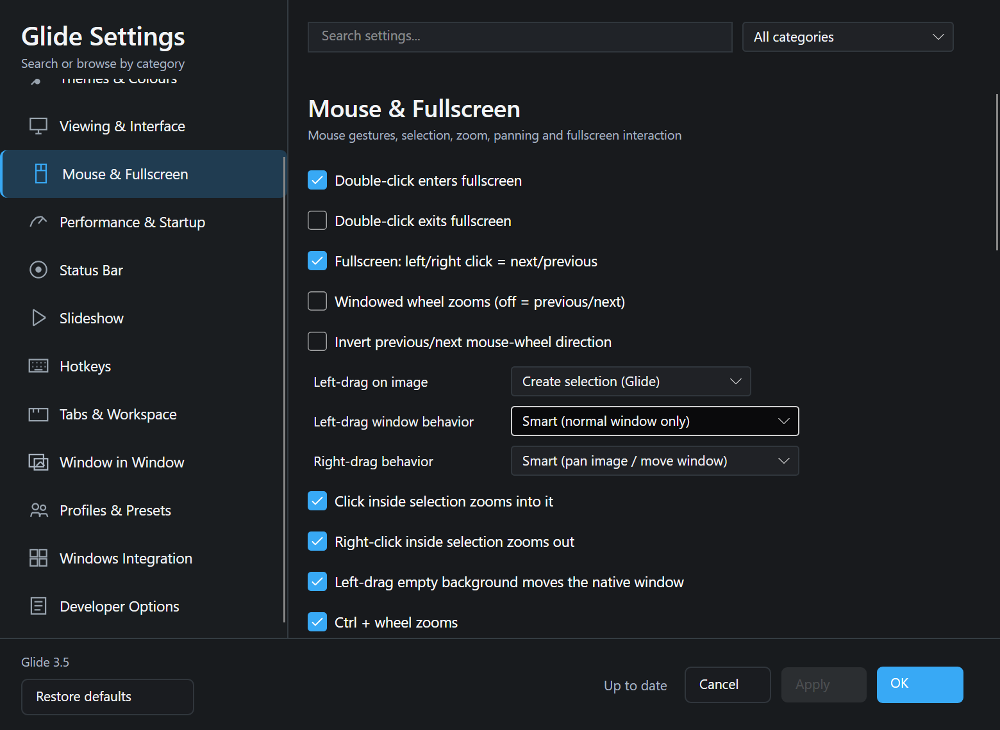
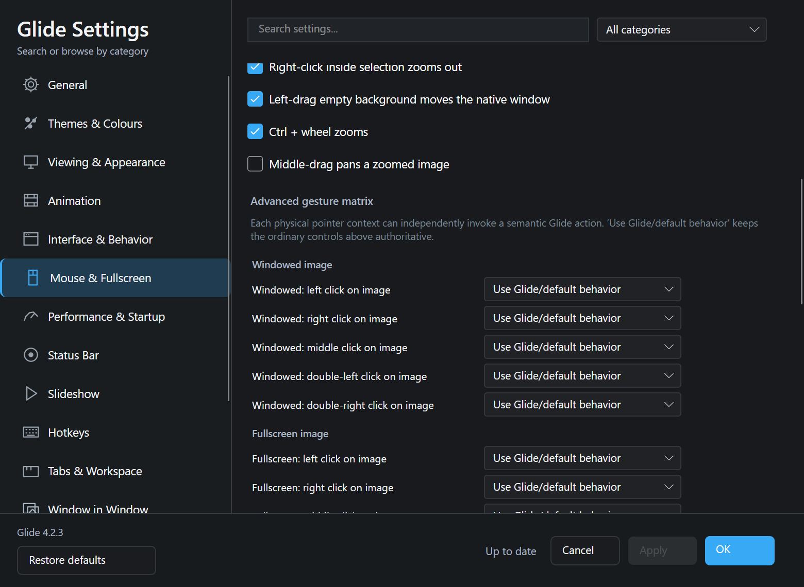
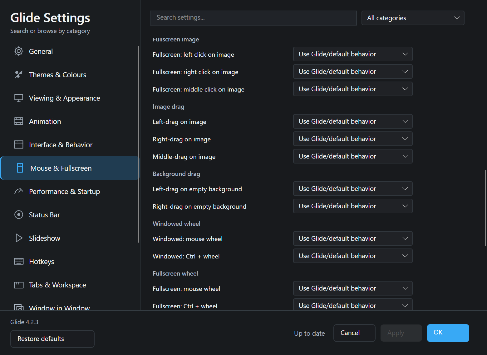
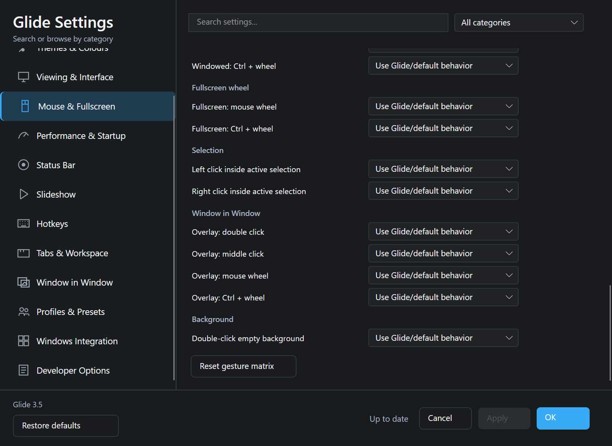

Glide features one of the most comprehensive input-binding engines available:

* **Left-Drag Drag Policy:** Configure left-click-and-drag to *Create Selection Box*, *Pan Image Canvas*, or *Move Window*.
* **Right-Drag Policy:** Choose between *Smart Mode* (pan if zoomed, move window if fit-to-screen), *Pan Only*, *Move Window*, or *Disabled*.
* **Selection Box Actions:** Click inside a selection box to instantly crop-zoom into that exact region; right-click inside to zoom back out.
* **Wheel Navigation & Zoom:** Configure the mouse wheel for smooth zooming (centered at the mouse cursor) or previous/next file navigation, with direction inversion options.
* **Window Drag on Canvas:** Option to drag the native application window by grabbing empty canvas background space.
* **Physical Gesture Matrix:** Map combinations of Left, Middle, Right, Wheel, and Modifier keys (Ctrl, Shift, Alt) directly to semantic actions.

---

### 5. Performance, Memory & Staged Decoding

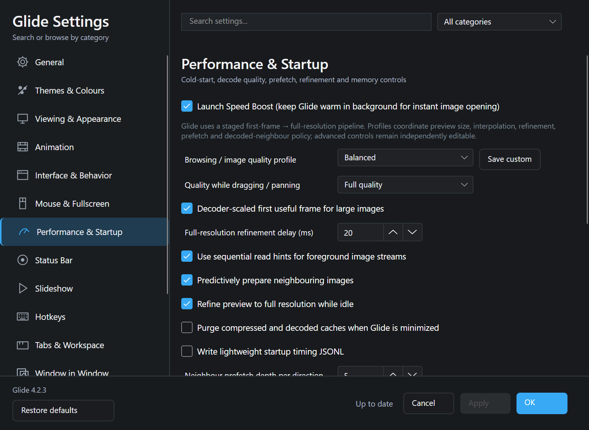
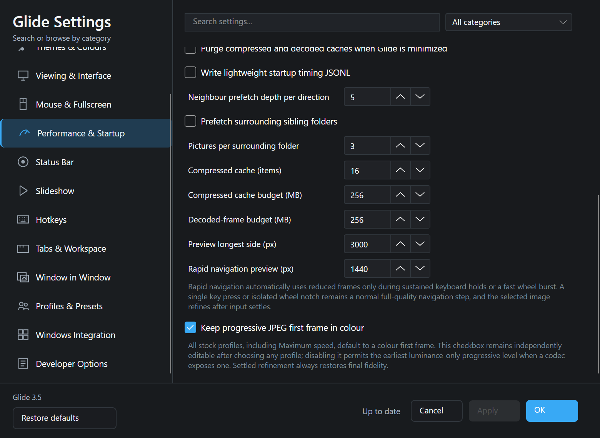

Engineered for blazing speed even when browsing folders containing thousands of large RAW or high-megapixel images:

* **Performance Tuning Profiles:** Instant presets for *Maximum Speed*, *Balanced*, *Maximum Quality*, or *User Custom*.
* **Staged First-Frame Display:** Renders a decoder-scaled low-latency first frame immediately, followed by sub-millisecond background refinement to full resolution.
* **Prefetch Engine:**
  * Configurable prefetch depth (e.g., 2 images ahead and behind).
  * Surrounding sibling-folder preloading for instant folder transitions.
  * Dedicated decoded-frame cache and compressed-image memory budgets (MB limit and item count).
* **Rapid Navigation Burst Mode:** Detects rapid wheel or arrow key scrolling and renders lightweight preview frames during bursts, restoring full quality the instant scrolling settles.
* **Resource Optimization:** Automatic cache purging when Glide is minimized to release system memory.

---

### 6. Status Bar Customization

Completely customize the information and action buttons visible in the status bar:

* **Modular Element Toggles:** Individually show or hide Navigation Arrows, Zoom Controls, Slideshow Button, Fit-Width / Fit-Height toggles, Metadata Info popover, Context Menu button, and Window Close icon.
* **Metadata Statistics Selector:** Select which details appear in real time:
  * *Image index in folder (e.g., 14 / 320)*
  * *Dimensions & Megapixels (e.g., 3840 × 2160 • 8.3 MP)*
  * *Current Zoom Percentage (e.g., 100%)*
  * *File Size (e.g., 2.4 MB)*
  * *Image Codec / Format (e.g., PNG, AVIF)*
* **Adaptive Multi-Row Reflow:** When resizing to narrow windows, controls gracefully wrap into multi-line layouts without clipping.

---

### 7. Automated Slideshow

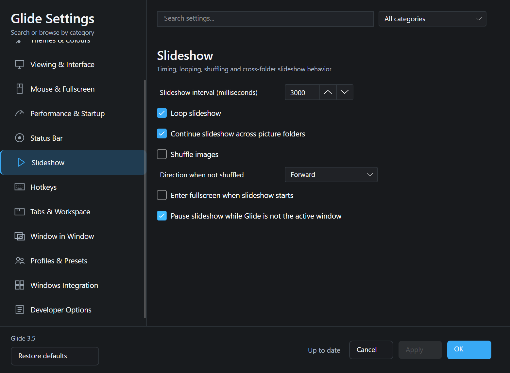

High-performance presentation mode for image portfolios and galleries:

* **Interval Timing:** Millisecond-level duration control (e.g., 5000 ms).
* **Sequence Control:** Choose between linear loop, bidirectional playback, or randomized shuffle.
* **Continuous Folder Playback:** Seamlessly advance across adjacent folders during slideshow playback.
* **Fullscreen & Focus Integration:** Automatically trigger fullscreen mode upon slideshow start, and pause the timer when Glide loses window focus.

---

### 8. Keyboard Shortcuts & Emulation Presets

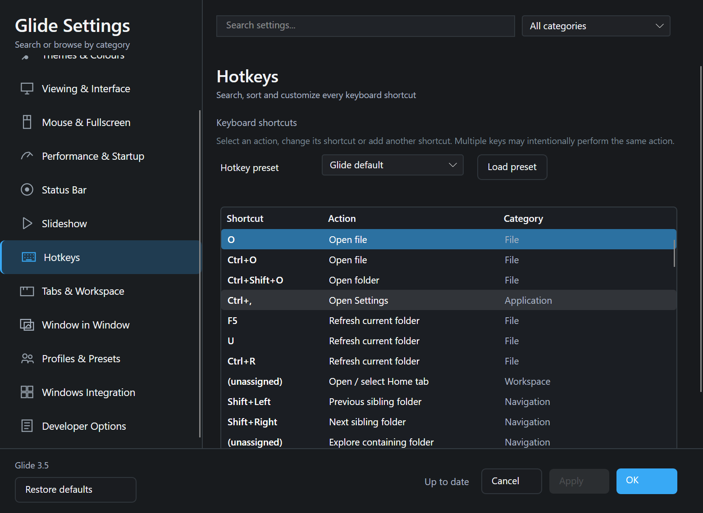
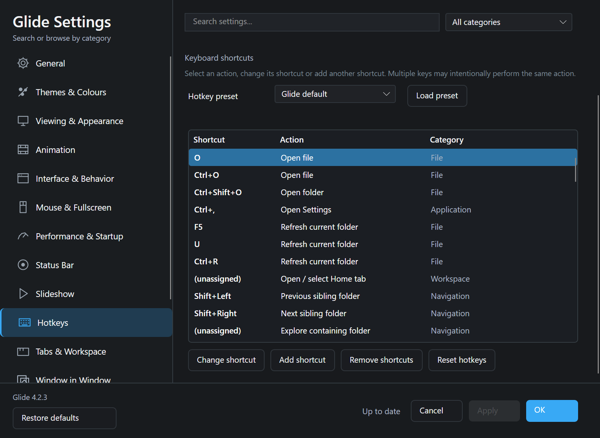
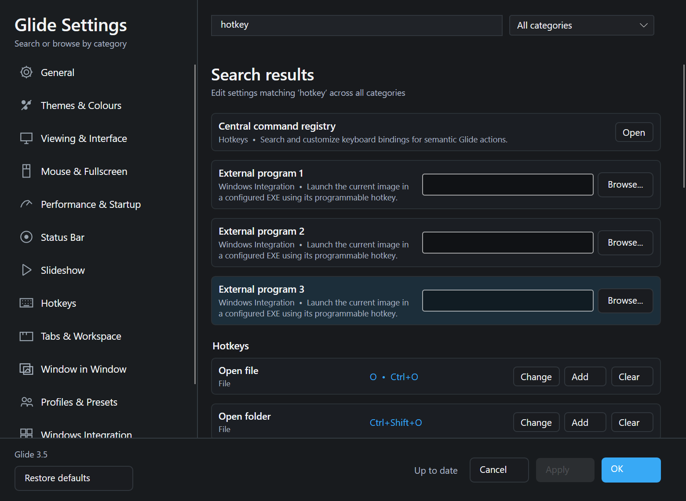

Glide provides a complete keyboard shortcut manager with 1-click emulation presets:

* **Viewer Compatibility Presets:** Instantly switch keybindings to match familiar workflows:
  * **Glide Default**
  * **Windows Photos**
  * **IrfanView**
  * **nomacs**
  * **FastStone Image Viewer**
  * **XnView MP**
* **Instant Shortcut Search:** Real-time search filter across all command names, categories, and assigned keys.
* **Custom Rebinding:** Add multiple hotkeys per command, modify key combinations, or restore defaults on a per-action basis.

---

### 9. Window-in-Window / Transparent Overlays

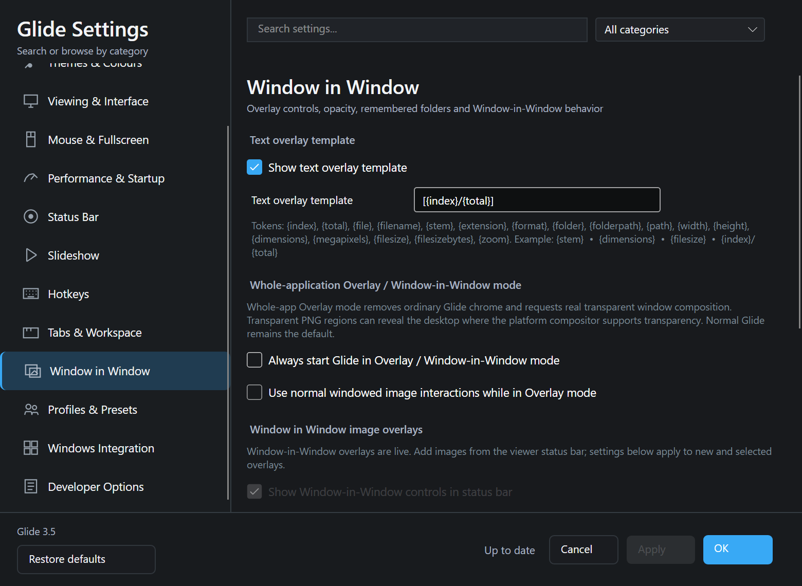
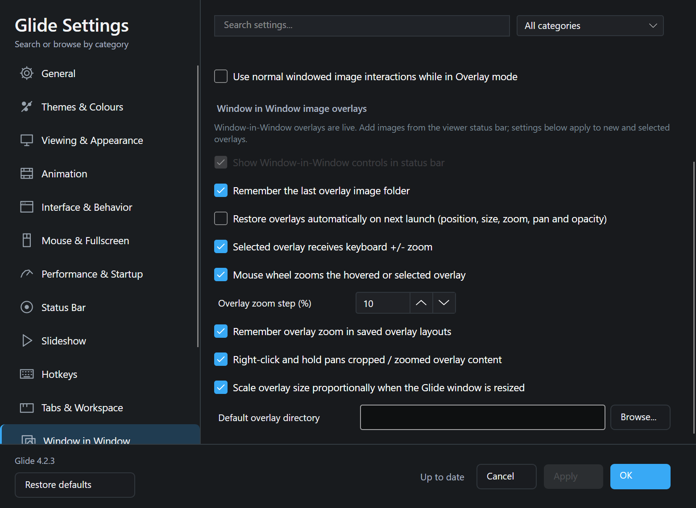

Glide includes a dedicated non-destructive overlay system for image comparison, reference art, and HUD data:

* **Custom HUD Text Overlay:** Fully customizable metadata HUD using tokens:
  * Format: [%INDEX%/%TOTAL%] %FILENAME%  %DIMS% (%MEGAPIXELS% MP)  %FILESIZE%  %ZOOM%
* **Whole-App Overlay Mode:** Run Glide as a borderless, transparent floating overlay over reference applications with alpha-channel passthrough.
* **Independent Overlay Controls:**
  * Multi-image pinboard with independent zoom, pan, opacity, and rotation.
  * Keyboard + / - and mouse wheel direct zoom on hovered or selected overlays.
  * Automatic state restoration on next launch (retaining coordinates, scale, and opacity).
  * Proportional scaling when the parent window resizes.

---

### 10. Profiles & Settings Portability

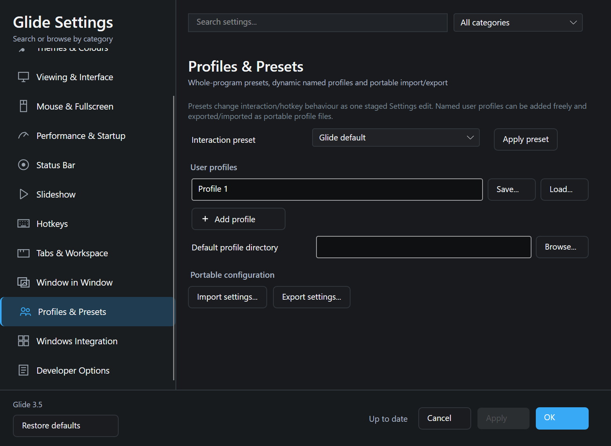

* **Named User Profiles:** Save distinct configurations for different workflows (e.g., Photography Review, Pixel Art Inspection, Reference Overlay).
* **Portability:** Export and import settings as clean, human-readable JSON files.
* **Staged Configuration:** Preview and test configuration changes before applying them permanently.

---

### 11. Windows Integration & External Tools

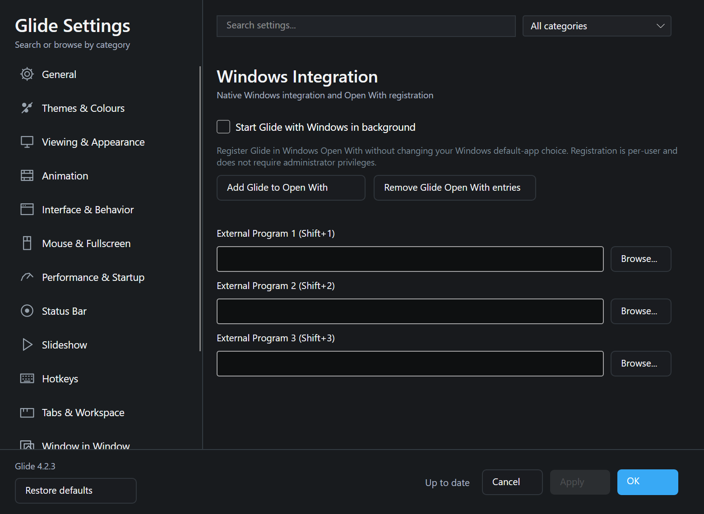

* **Open With Integration:** Register Glide with the Windows Open With context menu without overriding your default OS application associations.
* **Per-User Registration:** Does not require administrator privileges or UAC elevation.
* **External Tool Quick-Launch:** Assign up to three external graphics editors (e.g., Photoshop, GIMP, Paint.NET) accessible instantly via Shift + 1, Shift + 2, and Shift + 3.

---

### 12. Developer Tools & Built-In Diagnostics

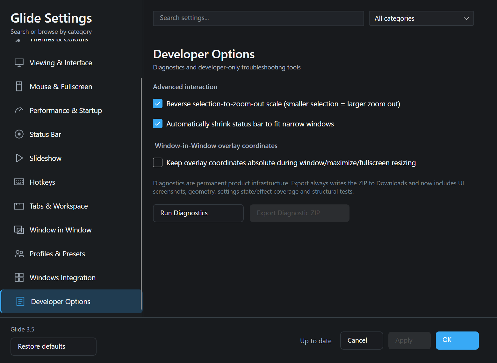
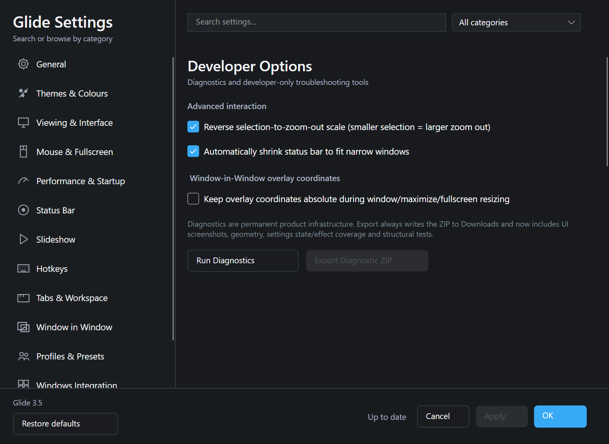

* **Diagnostic ZIP Exporter:** Generates a full diagnostic archive with UI geometry, state coverage, active settings diffs, and benchmark logs for easy issue reporting.
* **Mathematical Tweaks:** Options for inverse zoom-out scaling and absolute coordinate locks across multi-monitor setups.

---

## Recognized & Routed Formats

Glide recognizes and routes **196 filename extensions**:

<strong>Expand full list of 196 recognized/routed extensions</strong>

.jpg, .jpeg, .jpe, .jfif, .jif, .jfi, .pjpeg, .pjpg, .png, .apng, .mng, .jng, .bmp, .dib, .rle, .wbmp, .tif, .tiff, .btf, .gif, .ico, .cur, .ani, .icns, .webp, .heic, .heif, .heics, .heifs, .hif, .avif, .avifs, .svg, .svgz, .jxr, .wdp, .hdp, .jp2, .j2k, .j2c, .jpc, .jpx, .jpf, .jpm, .mj2, .jxl, .psd, .psb, .pdd, .xcf, .ora, .kra, .afphoto, .afdesign, .afpub, .clip, .csp, .pdn, .psp, .pspimage, .pxr, .tga, .targa, .icb, .vda, .vst, .dpx, .cin, .sgi, .rgb, .rgba, .bw, .ras, .sun, .iff, .lbm, .ilbm, .img, .pic, .pict, .pct, .pict2, .eps, .epsf, .ai, .pdf, .pnm, .ppm, .pgm, .pbm, .pam, .pfm, .pcx, .qoi, .hdr, .rgbe, .xyze, .exr, .dds, .ff, .fits, .fit, .fts, .fts.gz, .hdr.gz, .xbm, .xpm, .xwd, .cut, .mac, .mpo, .jps, .pns, .dng, .cr2, .cr3, .crw, .nef, .nrw, .arw, .srf, .sr2, .raf, .orf, .ori, .rw2, .rwl, .pef, .ptx, .3fr, .fff, .iiq, .cap, .eip, .mef, .mos, .mrw, .x3f, .erf, .kdc, .dcr, .k25, .bay, .srw, .rwz, .gpr, .mdc, .raw, .r3d, .ari, .cinema, .dcs, .drf, .dsc, .r2d, .rw1, .dcm, .dicom, .ima, .nii, .nii.gz, .mha, .mhd, .nrrd, .ndpi, .svs, .vms, .vmu, .scn, .mrxs, .bif, .czi, .lif, .lsm, .ome.tif, .ome.tiff, .vsi, .ktx, .ktx2, .pvr, .astc, .basis, .tex, .vtf, .wal, .spr, .cdr, .cmx, .cpt, .emf, .wmf, .emz, .wmz, .dwg, .dxf, .skp

### Protected Core Fast-Path Suffixes
.jpg, .jpeg, .jpe, .png, .bmp, .gif, .tif, .tiff, .webp, .ico

---

## Building from Source

On Windows:
* Build the application: run uild.cmd
* Build the complete standalone installer: run uild-installer.cmd

---

## Architectural Philosophy & Manifesto

Glide follows six core design principles:
1. **Measured Image-Open Speed:** Zero splash screens; direct, single real-window launch.
2. **Smooth High-Volume Navigation:** Instant folder traversal and predictive caching.
3. **Broad Format Breadth:** 196 extensions recognized without loading heavy optional codecs during cold startup.
4. **Deep Customizability:** Total control over keyboard, mouse, gestures, UI layout, and performance policies.
5. **Modern Tabbed Multitasking:** Drag-and-drop tab detachable workflows across independent windows.
6. **Self-Documenting Architecture:** Thoroughly documented codebase with diagnostic instrumentation for easy maintenance.

For comprehensive technical specifications, refer to [GLIDE_MANIFESTO_AND_HANDOFF.md](GLIDE_MANIFESTO_AND_HANDOFF.md).

